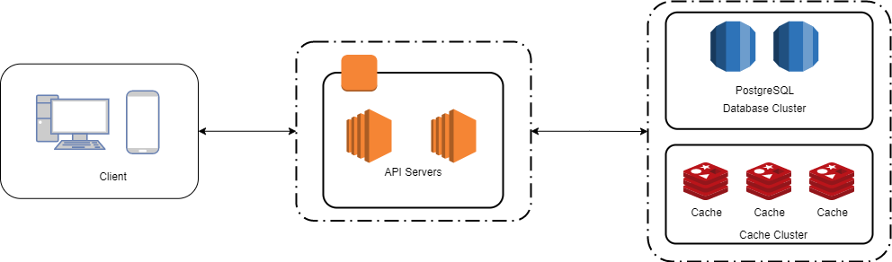

# Architecture

## Project Structure

    .
    ├── coverage                # Test case coverage files
    ├── dist                    # Compiled files
    ├── docs                    # Documentation files
    ├── node_modules            # Node modules files
    ├── src                     # Source files, spec test files
    ├── test                    # E2E tests
    ├── .env                    # Environment variables file
    ├── .eslintrc.js            # Eslint configuration file
    ├── LICENSE
    └── README.md

## Software Stack



SVote is a Nest.js, fastify based, application that run on the following software:

- Alpine Linux 3.11
- PostgreSQL 13.1
- Redis 6.0
- Node.js 14.15.4

## Features

### Authentication

By using JWT as a token base authentication, every request is stateless and the authorizing server needs to maintain no state between each request. Which means we can take advantages from cloud service and scale-out the API server. Every API endpoint except `/api/auth`, required an access token to send the request.

#### Token identifier

In every access token, we stored the user identifier to JWT payload. By doing that, we can make sure the request is made by the same person, and issued from our API server.

```json
{
  "uid": "<hashed_userId>",
  "iat": 1612509229,
  "exp": 1612512829
}
```

\*_JWT Token Payload Example_

#### Refresh Token

In `/api/auth` request, it will issue two kind of token, `accessToken`, and `refreshToken`. The `accessToken` is a short-lived JWT token used to send API request, and `refreshToken` is used for exchanging an `accessToken` once it expired.

### Poll

In SVote, every user can create their own campaign without any extra permission. Only active (within start/end time), and ended campaign will be displayed. Any future poll will be filtered until it started. The ordering of the poll list should be:

1. Active campaign with most vote count.
2. Recent ended campaign.

The start/end date of the poll is precised to each day. In SVote, it take advantage from this requirement, and using [cronjob](/src/tasks/tasks.service.ts#L69-85) to mark poll as inactive in every day mid-night.

#### Vote Count

For each poll option, it will be updated immediately to the database once the vote is submitted. But for the campaign total number of vote count, it will be updated via a [cronjob](/src/tasks/tasks.service.ts#L21-L67).

### Sensitive data

For the personal data like HKID number, it will not store the HKID as a plaintext. It used `HMAC-SHA-256` to hash the HKID number and store it ONLY when the user vote/create a poll. Any vote result after the campaign is ended a month will be removed by the [cronjob](/src/tasks/tasks.service.ts#L87-L94), and [expired in redis](/src/poll/poll.service.ts#L124-L129) automatically.

#### Attacks

Although the HKID is already being hashed by `HMAC-SHA-256`, it still may suffer from rainbow table attack due to the entropy of a HKID number is rather small consider modern computer power.
